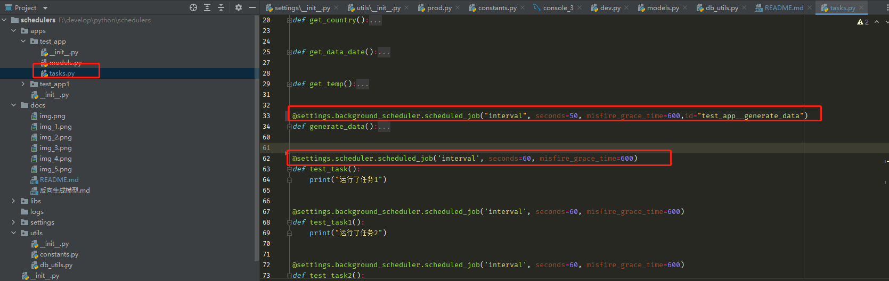

一.注册app 
   1.在settings目录下面__init__.py文件中的INSTALL_APPS加入app名，
     例如"test_app"如下图：
         

二.创建app
   1. 在apps目录下创建自己的app包， 例如"test_app"如下图：
        
   2. 在test_app中创建模型文件models.py, 业务代码文件tasks.py
   3. models.py中的模型要继承自定义模型BaseModel，如下图：
      
   4. tasks.py中根据业务场景需求，选择合适的调度器，用装饰器“scheduled_job”并设置相关定时参数，如下图:
      

三.本地调试
   1.将manage.py中的配置文件文件指向"settings.dev",如下图：
     
   2.切到项目根目录,执行 pip3 install -r requirements.txt
   3.执行 python manage.py 就成功启动项目

四.服务器部署
   1.将manage.py中的配置文件文件指向"settings.prod",如下图：
     
   2.切到项目根目录,执行 pip3 install -r requirements.txt
   3.执行 python manage.py 就成功启动项目

五.附录：
   apscheduler官网文档地址：https://apscheduler.readthedocs.io/en/3.x/